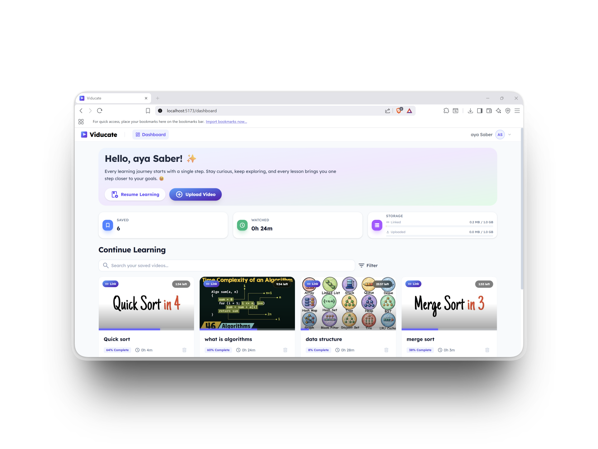
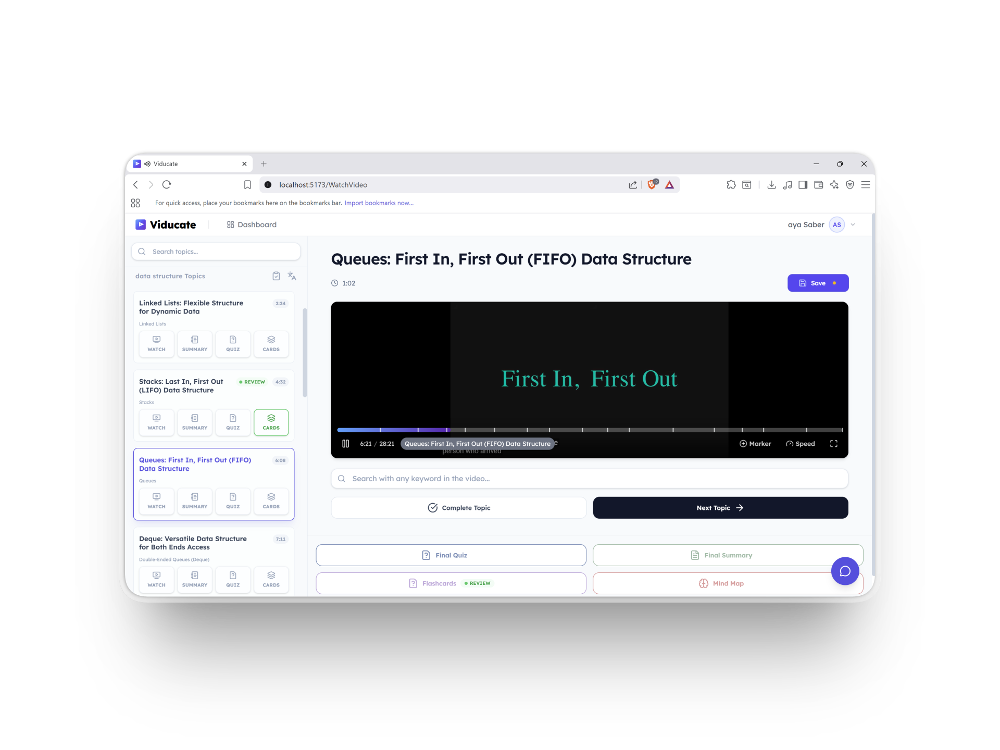
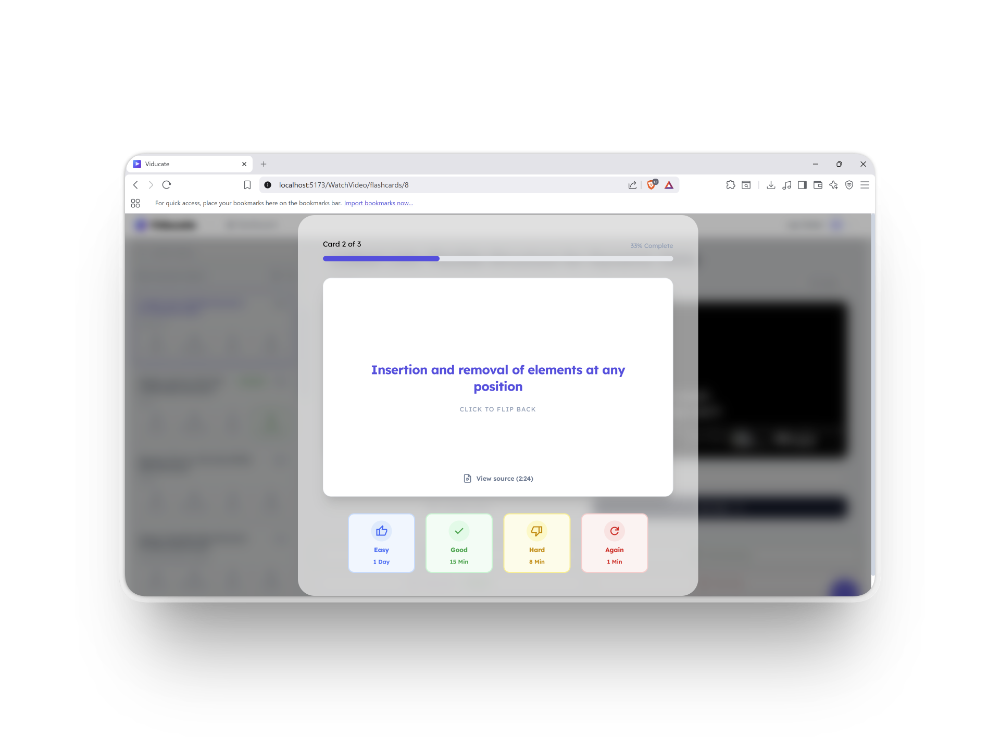
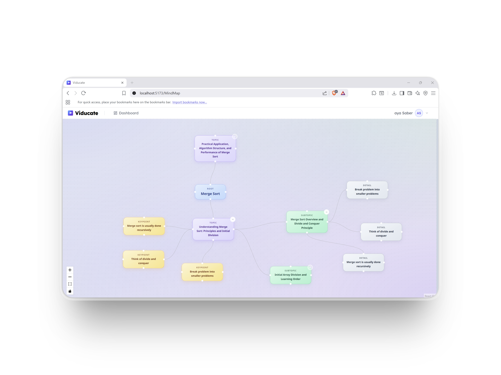
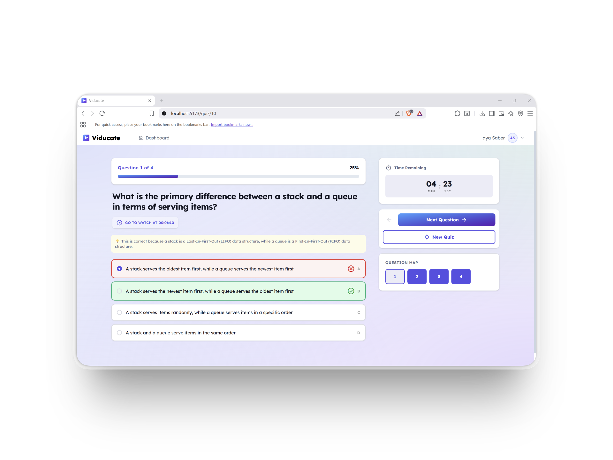
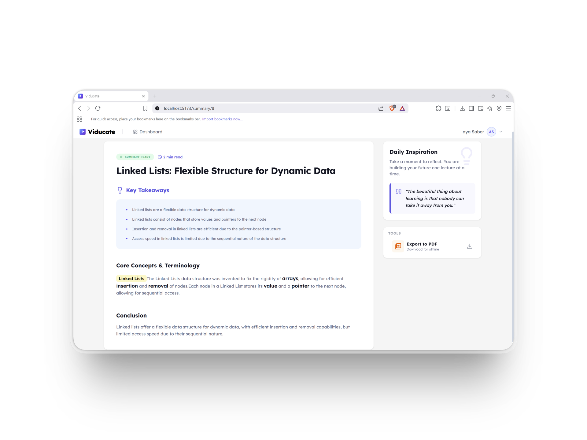
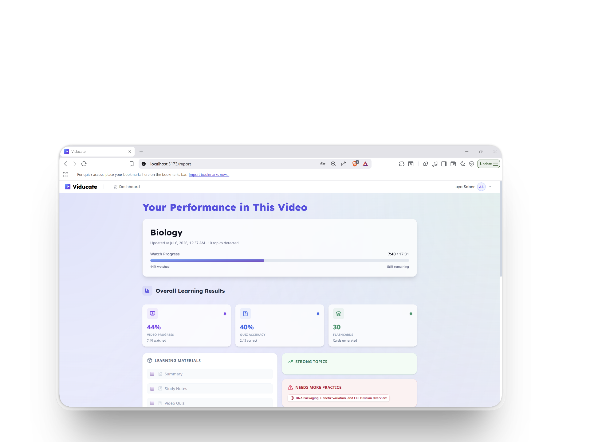

<div align="center">

# 🎓 Viducate

### AI-Powered Interactive Video Learning Platform

*Turn any video lecture into an interactive, personalized learning experience.*

[](https://react.dev/)
[](https://www.typescriptlang.org/)
[](https://fastapi.tiangolo.com/)
[](https://www.postgresql.org/)
[](https://ai.google.dev/)


</div>
---

## 📖 About The Project

**Viducate** transforms passive video watching into an active, AI-guided learning journey. Instead of just playing a lecture from start to finish, Viducate analyzes the video content and gives learners tools to **understand, review, test, and retain** what they watch — all in one place.

Built as a graduation project, Viducate combines a **React + TypeScript** frontend using **Clean Architecture** with a **FastAPI + AI/ML** backend to deliver real-time video intelligence.


---

## ✨ Key Features

| | Feature | Description |
|---|---|---|
| 🎥 | **Smart Video Player** | Custom player built on ReactPlayer/YouTube with seek-based analytics |
| 🧠 | **Stuck Detection** | A custom `useVideoAnalytics` hook detects when a learner is struggling — via seek patterns and pause thresholds — and offers help exactly when needed |
| 💬 | **AI Chat Assistant** | Ask questions about the video content and get context-aware answers, with cancellable in-flight requests |
| 🗂️ | **Auto Flashcards** | Generates flashcards per segment or for the whole video to reinforce key concepts |
| 🧩 | **Mind Maps** | Automatically builds visual mind maps of the video's topics and subtopics |
| 📝 | **Study Notes & Summaries** | AI-generated summaries and structured study notes, exportable as PDF |
| ❓ | **Adaptive Quizzes** | Auto-generated quizzes with difficulty levels to test understanding |
| 🔍 | **Semantic Search** | Search inside a video by meaning, not just keywords |
| 📊 | **Progress Reports & Dashboard** | Tracks learning progress, strengths, and weak topics over time |
| 🖼️ | **Slide Extraction & OCR** | Extracts slides/frames from video and runs OCR for text-based content |


## 📸 Screenshots & Demo

<div align="center">

### 🏠 Dashboard


### ▶️ Watch & Learn


### 🗂️ Flashcards


### 🧩 Mind Map


### ❓ Quiz


### 📝 Summary


### 📊 Report


<br>

🎥 **Full walkthrough video: https://drive.google.com/file/d/1Y53310KNrXnVwuSTQm-8ecbdRr6es71M/view?usp=sharing

</div>

---


## 🏗️ Architecture

Viducate follows a **Clean Architecture** approach on the frontend (domain / data / presentation layers per feature) and a modular, service-oriented structure on the backend.

```
Viducate/
├── frontend/          # React + TypeScript (Vite)
│   └── src/
│       ├── features/  # auth, dashboard, watch_video, quiz, flashcards, chat_bot, ...
│       ├── core/      # shared api client, hooks, contexts, constants
│       └── layout/
├── backend/           # FastAPI
│   └── app/
│       ├── api/v1/    # REST endpoints
│       ├── ml/        # engines & processors (summarization, quiz, mindmap, OCR...)
│       ├── services/  # business logic
│       ├── repositories/
│       └── models/    # SQLAlchemy models
├── alembic/           # DB migrations
├── docs/              # architecture, API, database, deployment docs
└── docker-compose.yml
```

Each frontend feature (`auth`, `dashboard`, `quiz`, `flashcards`, `mindMap`, `chat_bot`, `watch_video`...) is self-contained with its own `domain`, `data`, `api`, and `presentation` layers — making the codebase scalable and easy to navigate.


---

## 🛠️ Tech Stack

**Frontend**
- React 18 + TypeScript
- TanStack Query (server state & caching)
- React Router (with navigation guards)
- Tailwind CSS v4
- Custom hooks & Clean Architecture pattern

**Backend**
- FastAPI (Python)
- PostgreSQL + SQLAlchemy + Alembic
- ChromaDB (vector search / embeddings)
- AI/ML pipeline for summarization, quiz generation, mind maps, OCR, and semantic search


---

## 🚀 Getting Started

### Prerequisites
- Node.js 18+
- Python 3.10+
- PostgreSQL

### Installation

```bash
# 1. Clone the repository
git clone https://github.com/<your-username>/viducate.git
cd viducate

# 2. Backend setup
cd backend
python -m venv venv
source venv/bin/activate  # Windows: venv\Scripts\activate
pip install -r requirements.txt
cp .env.example .env      # fill in your own values
alembic upgrade head

# 3. Frontend setup
cd ../frontend
npm install
npm run dev
cp .env.example .env      # fill in your own values

```

The frontend will be available at `http://localhost:5173` and the backend API at `http://localhost:8000` (adjust based on your `docker-compose.yml`).

> ⚠️ Never commit your real `.env` files. Use `.env.example` as a reference for required variables.


<div align="center">

Made with ❤️ and a lot of ☕ as a graduation project

</div>
